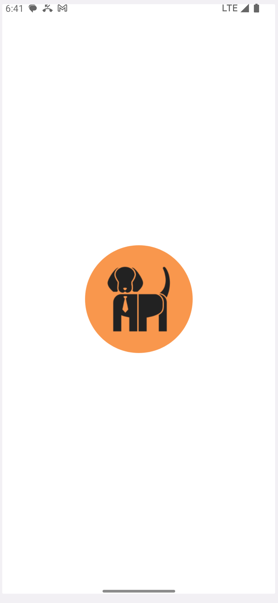

# Breeds Dogs

**Breeds Dogs** is a Flutter application that allows you to browse images of various dog breeds.

</a>
<div align="justify">

 <br>
   <p>
    
    
    
  </p>
<br>

<hr>

## Running the Application

Make sure you have Flutter and Dart installed on your machine. You can check the versions used for developing this project.

- Flutter: 3.13.6
- Dart: 2.19.6

### Cloning the Repository

```bash
git clone https://your-repository/Breeds-Dogs.git
cd Breeds-Dogs
```
### Installing Dependencies

```bash
flutter pub get
```
# Running on Android

Ensure you have an Android device connected or an Android emulator running. Then, run the following command:

```bash
flutter run
```
# Running on iOS
Navigate to the ios folder in your project and run:

```bash
cd ios
pod install
```
Ensure you have an iOS device or an iOS simulator running. Then, run the following command:

```bash
flutter run
```

This will start the application on the respective device or emulator. You should be able to browse images of different dog breeds.
